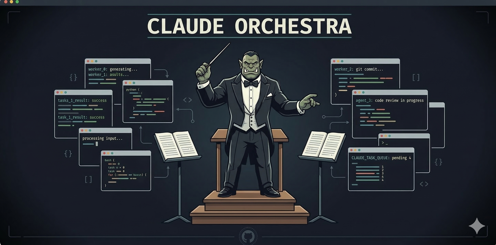

<p align="center">
  
</p>

<p align="center">
  <strong>Manage multiple Claude Code, Kimi CLI, Forge Code, Gemini CLI, and OpenCode sessions from a single terminal.</strong><br>
  One orchestrator AI controls worker AI sessions across your projects via tmux.
</p>

<p align="center">
  <a href="#install">Install</a> &bull;
  <a href="#usage">Usage</a> &bull;
  <a href="#commands">Commands</a> &bull;
  <a href="https://github.com/alperduzgun/claude-orchestra/releases">Releases</a>
</p>

---

## Quick Start (for AI Assistants)

Two prompts below — one for **fresh install**, one for **update**. Copy-paste into Claude Code, ChatGPT, Cursor, or any AI assistant.

### Install prompt

```
Install Claude Orchestra — a tmux-based multi-agent AI orchestrator for Claude Code, Kimi CLI, Forge Code, Gemini CLI, and OpenCode.

Prerequisites: tmux 3.0+, zsh, Claude Code (https://docs.anthropic.com/en/docs/claude-code) OR Kimi CLI (https://github.com/moonshot-ai/kimi-cli) OR Forge Code (https://github.com/tailcallhq/forgecode) OR Gemini CLI (https://ai.google.dev/gemini-cli/docs) OR OpenCode
Recommended: Ghostty terminal (https://ghostty.org/) for auto-restore and Cmd+number window switching

Steps:
1. Install missing prerequisites:
   - macOS: brew install tmux zsh && brew install --cask ghostty
   - Linux: apt install tmux zsh  (Ghostty: https://ghostty.org/download)
2. git clone https://github.com/alperduzgun/claude-orchestra.git ~/claude-orchestra
3. cd ~/claude-orchestra && chmod +x install.sh && ./install.sh
4. The installer will ask about optional features — say yes to all for the full experience:
   - Ghostty auto-restore (every tab/window auto-attaches to orchestra session)
   - Ghostty Cmd+number keybindings (Cmd+0 for orchestrator, Cmd+1-9 for workers)
   - tmux config (Catppuccin theme, Ctrl+A prefix, status bar, vim navigation)
5. If ~/.local/bin is not in PATH: echo 'export PATH="$HOME/.local/bin:$PATH"' >> ~/.zshrc && source ~/.zshrc
6. Add projects: dev add <alias> <path>  (repeat for each project)
7. Start: dev  (Claude orchestrator) or  dev kimi  (Kimi orchestrator) or  dev forge  (Forge orchestrator)
8. Verify: run dev status and dev list — confirm projects are registered and session is running.

If anything doesn't work, read ~/claude-orchestra/TROUBLESHOOTING.md
```

### Update prompt

```
Update Claude Orchestra to the latest version.

Steps:
1. Run: dev update
   - Shows what's new (changelog)
   - Shows which files will be updated vs preserved
   - Asks for confirmation before proceeding
   - Preserves: projects.conf, Ghostty config, tmux config
   - Updates: dev script, worker-safe root prompts, shared docs, and the dedicated `orchestrator/` prompt directory

2. If dev update can't find the repo (installed as copy, not symlink):
   echo 'ORCHESTRA_REPO="~/claude-orchestra"' >> ~/.config/orchestra/orchestra.conf
   dev update

3. If the orchestrator is running, restart it after update:
   Ctrl+C in the orchestra window (Ctrl+A 0), then run: dev
   (Worker sessions continue unaffected — no need to restart them)
```

---

## How it works

```
Ghostty / Terminal
└── tmux session: "devenv"
    ├── Window 0: Orchestra (you talk to this AI - Claude, Kimi, or Forge)
    ├── Window 1: project-a (worker AI)
    ├── Window 2: project-b (worker AI)
    └── Window 3: project-c (worker AI)
```

**Orchestrator Options:**
- `dev` → Claude orchestrator (default)
- `dev kimi` → Kimi orchestrator
- `dev forge` → Forge orchestrator

**Worker Options:**
- `dev start <project>` → Start Claude worker
- `dev kimi start <project>` → Start Kimi worker
- `dev forge start <project>` → Start Forge worker

- You tell the orchestrator what to do across projects
- It starts worker sessions and assigns tasks
- Switch to any window with `Ctrl+A <number>` for manual control
- Max 3 concurrent AI sessions (Claude + Kimi + Codex + Forge combined, configurable, RAM-dependent)
- Close Ghostty and reopen — session resumes where you left off
- Mix and match: Claude orchestrator can control Kimi/Forge workers and vice versa!

### Prompt Amplification

The orchestrator doesn't just forward your messages — it **amplifies** them. You give a brief, high-level instruction; the orchestrator translates it into a detailed, context-rich task for each worker.

```
You:            "check for false positives"

Orchestrator:   "14 fixes were applied. Cross-reference each against source:
                 1. dev:16 — verify ORCHESTRA_DIR controls CLAUDE.md path
                 2. dev:760 — verify case statement has claude|cc
                 3. install.sh:88 — verify interactive Ghostty prompt exists
                 ...
                 Return CORRECT or FALSE POSITIVE for each with explanation."
```

Workers have zero context about your conversation. The orchestrator bridges this gap by injecting file paths, line numbers, error messages, and acceptance criteria into every task — so you can stay high-level while workers get exactly what they need.

## Requirements

- macOS or Linux
- [tmux](https://github.com/tmux/tmux) 3.0+
- [zsh](https://www.zsh.org/)
- [Claude Code](https://docs.anthropic.com/en/docs/claude-code) AND/OR [Kimi CLI](https://github.com/moonshot-ai/kimi-cli) AND/OR [Forge Code](https://github.com/tailcallhq/forgecode)
- [Ghostty](https://ghostty.org/) (recommended, for auto-restore)

## Install

```bash
git clone https://github.com/alperduzgun/claude-orchestra.git
cd claude-orchestra
chmod +x install.sh
./install.sh
```

The installer will:
1. Install `dev` to `~/.local/bin/` (symlinked from repo)
2. Copy worker-safe root prompts plus shared rule files to `~/.config/orchestra/`, and copy orchestrator-only prompts to `~/.config/orchestra/orchestrator/`
3. Create config at `~/.config/orchestra/projects.conf`
4. **Ask** if you want Ghostty auto-restore (adds `command` to Ghostty config — works for all tabs/windows)
5. **Ask** if you want Ghostty Cmd+number keybindings (switch windows with Cmd+0, Cmd+1...)
6. **Ask** if you want orchestra tmux config (Catppuccin theme, Ctrl+A prefix, worker status bar, vim navigation, window-size fix — backs up existing config)

To update orchestra later: `dev update`

Having issues? See [TROUBLESHOOTING.md](TROUBLESHOOTING.md).

## Setup

Add your projects:

```bash
dev add myapp ~/Development/my-app
dev add backend ~/projects/api-server
dev add frontend ~/code/web-app
```

Projects are stored in `~/.config/orchestra/projects.conf`.

## Usage

```bash
# Start the orchestrator
## Claude orchestrator (default)
dev                      # shortest
dev o                    # short alias  
dev orchestra            # full command

## Kimi orchestrator
dev kimi                 # Start Kimi as orchestrator

## Forge orchestrator
dev forge                # Start Forge as orchestrator

# The orchestrator asks which projects to work on
# You say: "myapp and backend"
# It runs: dev start myapp && dev start backend (or dev kimi start ... or dev forge start ...)

# Or manually:
dev start myapp          # Start Claude for a project
dev kimi start myapp     # Start Kimi for a project
dev forge start myapp    # Start Forge for a project
dev send myapp "fix X"   # Send a task (auto-detects Claude/Kimi)
dev broadcast "run tests" # Send to all active AI sessions
dev status               # See what's running
dev kill myapp           # Stop a project session
dev list                 # All projects and their status
```

### Navigation

| Key | Action | Requires |
|-----|--------|----------|
| `Ctrl+A 0` | Switch to orchestrator | tmux (default) |
| `Ctrl+A 1` | Switch to first project | tmux (default) |
| `Ctrl+A w` | List all windows | tmux (default) |
| `Cmd+0` | Switch to orchestrator | Ghostty + keybindings |
| `Cmd+1` | Switch to first project | Ghostty + keybindings |

> **Note:** `Cmd+number` keybindings require the Ghostty config from `ghostty.example.conf` and tmux prefix set to `Ctrl+A`. See the example config for details.

### Monitoring & Automation

```bash
dev peek myapp           # Read worker's recent output
dev watch myapp          # Live tail of worker's log
dev done myapp           # Check if worker is idle or working
dev wait myapp           # Wait for worker to finish (default: 5min timeout)
dev ask myapp "question" # Send question, wait for response (2min timeout)
dev run myapp "task"     # Non-interactive task (claude --print)
dev history              # Show recent task history (default: last 30)
dev recover myapp        # Recover crashed session (--resume)
dev recover --all        # Recover all crashed sessions
```

## Session Restore

When Ghostty auto-restore is enabled (via installer), closing and reopening Ghostty automatically reattaches to your orchestra session. All AI workers (Claude, Kimi, Codex, and/or Forge) continue running in the background via tmux.

```
Close Ghostty → tmux session persists → Reopen Ghostty → auto-reattach
```

To enable manually:

```bash
# Add to ~/.config/ghostty/config:
command = ~/.local/bin/orchestra-attach

# Add to ~/.tmux.conf (prevents size conflicts with multiple windows):
set -g window-size latest
```

## Configuration

Environment variables (set in your shell profile):

| Variable | Default | Description |
|----------|---------|-------------|
| `ORCHESTRA_SESSION` | `devenv` | tmux session name |
| `ORCHESTRA_DIR` | `~/.config/orchestra/orchestrator` | Dedicated orchestrator prompt directory and working directory for window 0 |
| `ORCHESTRA_CONFIG_DIR` | `~/.config/orchestra` | Where `projects.conf` lives (can differ from `ORCHESTRA_DIR`) |
| `ORCHESTRA_AI` | `claude` | Orchestrator AI type: `claude`, `kimi`, or `forge` |
| `MAX_AI_SESSIONS` | `3` | Max concurrent AI sessions across Claude, Kimi, Codex, and Forge workers |
| `CLAUDE_BIN` | auto-detected | Path to Claude Code binary |
| `KIMI_BIN` | auto-detected | Path to Kimi CLI binary |
| `CODEX_BIN` | auto-detected | Path to Codex CLI binary |
| `FORGE_BIN` | auto-detected | Path to Forge Code binary |
| `ORCHESTRA_NOTIFY` | `1` | Set to `0`/`false`/`no`/`off` to silence desktop notifications fired by `dev wait`, `dev ask`, `dev run`, and `dev recover` |

> **Note:** `ORCHESTRA_DIR` and `ORCHESTRA_CONFIG_DIR` now default to different paths. `ORCHESTRA_DIR` controls where the orchestrator AI runs and reads its dedicated prompt files. `ORCHESTRA_CONFIG_DIR` controls where the project registry, worker-safe root instructions, and shared config files live.

## Commands

| Command | Description |
|---------|-------------|
| `dev` / `dev o` / `dev orch` / `dev orchestra` | Start the orchestrator (default: Claude) |
| `ORCHESTRA_AI=kimi dev` | Start Kimi orchestrator |
| `ORCHESTRA_AI=forge dev` | Start Forge orchestrator |
| `dev start <project>` | Start Claude in a tmux window |
| `dev kimi start <project>` | Start Kimi in a tmux window |
| `dev forge start <project>` | Start Forge in a tmux window |
| `dev send <project> "msg"` | Send message to a project's AI (auto-detects Claude/Kimi/Forge) |
| `dev peek <project> [lines]` | Read worker's recent output (default: 50 lines) |
| `dev watch <project>` | Live tail of worker's log |
| `dev done <project>` | Check if worker is idle or working |
| `dev wait <project> [sec]` | Wait for worker to finish, then notify (default: 300s) |
| `dev ask <project> "msg"` | Send question, wait for response (timeout: 120s) |
| `dev run <project> "task"` | Non-interactive task (claude --print) |
| `dev broadcast "msg"` | Send to all active AI sessions (Claude + Kimi + Codex + Forge) |
| `dev history [alias] [n]` | Show recent task history (default: 30 lines) |
| `dev recover <project>` | Recover crashed session |
| `dev recover --all` | Recover all crashed sessions |
| `dev status` | Show active windows and AI status |
| `dev list` / `dev ls` | List all configured projects |
| `dev add <alias> <path>` | Add a project |
| `dev remove <alias>` / `dev rm <alias>` | Remove a project |
| `dev notify <title> <msg>` | Send a desktop notification (macOS + Linux) |
| `dev kill <project>` | Kill a project window |
| `dev cc <project>` / `dev claude <project>` | Open Claude directly (no orchestration) |
| `dev <project>` | Open a shell in the project |
| `dev help` | Show help |

## Safety

- `dev send` only delivers to windows running AI (Claude, Kimi, Codex, or Forge) — never to a bare shell
- `dev broadcast` skips non-AI windows automatically
- Session limit is enforced in the script (not just documentation)
- AI readiness is verified before sending (polls for process, max 15s)
- Messages >1000 chars use tmux buffer (avoids PTY silent truncation at 1024 bytes)
- Installer never overwrites existing configs — asks before modifying
- Alias names validated (alphanumeric, hyphens, underscores only)
- `CLAUDE_BIN`, `KIMI_BIN`, `CODEX_BIN`, and `FORGE_BIN` quoted in all tmux commands (injection prevention)
- Notifications use safe argv passthrough (no shell interpolation)
- AI type is tracked per window for proper recovery

## License

MIT
